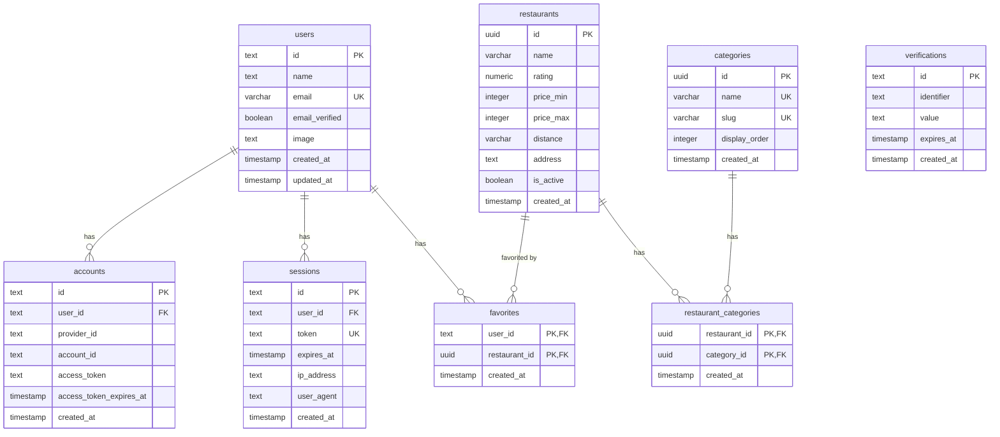

# データベーススキーマドキュメント

八丁堀ランチアプリのデータベース構造を説明します。

## 📊 テーブル一覧

### BetterAuth 認証関連テーブル
- [users](#users---ユーザー基本情報) - ユーザーの基本情報
- [accounts](#accounts---ログイン方法認証プロバイダー) - ログイン方法（Google OAuthなど）
- [sessions](#sessions---ログインセッション) - ログイン中のセッション管理
- [verifications](#verifications---一時的な認証データ) - 一時的な認証コード

### アプリケーション機能テーブル
- [restaurants](#restaurants---レストラン情報) - レストランの詳細情報
- [categories](#categories---カテゴリー) - レストランのカテゴリー
- [restaurant_categories](#restaurant_categories---レストランとカテゴリーの関連) - レストランとカテゴリーの多対多関係
- [favorites](#favorites---お気に入り) - ユーザーのお気に入りレストラン

---

## 🔐 BetterAuth 認証テーブル

### `users` - ユーザー基本情報

**役割**: アプリケーションのユーザー本体を管理

| カラム名 | 型 | 制約 | 説明 |
|---------|-----|------|------|
| `id` | text | PRIMARY KEY | ユーザーID（BetterAuthが自動生成） |
| `name` | text | NOT NULL | 表示名 |
| `email` | varchar(255) | NOT NULL, UNIQUE | メールアドレス |
| `email_verified` | boolean | NOT NULL, DEFAULT false | メール確認済みフラグ |
| `image` | text | - | プロフィール画像URL |
| `created_at` | timestamp | NOT NULL | 作成日時 |
| `updated_at` | timestamp | NOT NULL | 更新日時 |

**実際のデータ例**:
```
id: "1Uyqe0DbF107q5tMAko1DRHP8qOaq05q"
name: "田中太郎"
email: "tanaka@example.com"
email_verified: true
image: "https://lh3.googleusercontent.com/a/..."
```

**リレーション**:
- `accounts` (1:N) - 1人のユーザーは複数のログイン方法を持てる
- `sessions` (1:N) - 1人のユーザーは複数のセッションを持てる
- `favorites` (1:N) - 1人のユーザーは複数のお気に入りを持てる

---

### `accounts` - ログイン方法（認証プロバイダー）

**役割**: ユーザーがどの方法でログインしたかを記録（Google、GitHubなど）

| カラム名 | 型 | 制約 | 説明 |
|---------|-----|------|------|
| `id` | text | PRIMARY KEY | アカウントID |
| `account_id` | text | NOT NULL | プロバイダー側のユーザーID |
| `provider_id` | text | NOT NULL | プロバイダー名（"google", "github"など） |
| `user_id` | text | NOT NULL, FOREIGN KEY | ユーザーID（usersテーブル） |
| `access_token` | text | - | アクセストークン |
| `refresh_token` | text | - | リフレッシュトークン |
| `id_token` | text | - | IDトークン（OpenID Connect） |
| `access_token_expires_at` | timestamp | - | アクセストークン有効期限 |
| `refresh_token_expires_at` | timestamp | - | リフレッシュトークン有効期限 |
| `scope` | text | - | OAuthスコープ |
| `password` | text | - | パスワード（未使用、Google OAuthのみ） |
| `created_at` | timestamp | NOT NULL | 作成日時 |
| `updated_at` | timestamp | NOT NULL | 更新日時 |

**実際のデータ例**:
```
id: "acc_xyz123"
account_id: "105612345678901234567"  ← Google側のユーザーID
provider_id: "google"
user_id: "1Uyqe0DbF107q5tMAko1DRHP8qOaq05q"
access_token: "ya29.a0AfH6SMB..."
```

**なぜ必要？**:
- 1人のユーザーが複数のログイン方法を使える（Google + GitHub）
- メールアドレスが同じなら同一ユーザーとして紐付け

**例**:
```
User: 田中太郎 (tanaka@example.com)
├─ Account 1: Google (105612...)
└─ Account 2: GitHub (tanaka-taro)  ← 将来的に追加可能
```

---

### `sessions` - ログインセッション

**役割**: 現在ログインしているデバイス/ブラウザを管理

| カラム名 | 型 | 制約 | 説明 |
|---------|-----|------|------|
| `id` | text | PRIMARY KEY | セッションID |
| `expires_at` | timestamp | NOT NULL | セッション有効期限（7日間） |
| `token` | text | NOT NULL, UNIQUE | セッショントークン（Cookie保存） |
| `ip_address` | text | - | アクセス元IPアドレス |
| `user_agent` | text | - | デバイス/ブラウザ情報 |
| `user_id` | text | NOT NULL, FOREIGN KEY | ユーザーID（usersテーブル） |
| `created_at` | timestamp | NOT NULL | 作成日時 |
| `updated_at` | timestamp | NOT NULL | 更新日時 |

**実際のデータ例**:
```
id: "sess_abc123"
token: "eyJhbGciOiJIUzI1NiIsInR5cCI6IkpXVCJ9..."
expires_at: "2025-10-25 00:00:00"
ip_address: "192.168.1.100"
user_agent: "Mozilla/5.0 (Macintosh; Intel Mac OS X 10_15_7)..."
user_id: "1Uyqe0DbF107q5tMAko1DRHP8qOaq05q"
```

**なぜ必要？**:
- 複数デバイスから同時ログイン可能
- 「全デバイスからログアウト」機能を実装可能
- 不審なログインを検出可能（IP/ユーザーエージェント確認）

**例**:
```
User: 田中太郎
├─ Session 1: MacBook Pro (Safari)
├─ Session 2: iPhone (Chrome)
└─ Session 3: Windows PC (Edge)
```

---

### `verifications` - 一時的な認証データ

**役割**: メール確認リンク、パスワードリセット、OAuth認証の中間ステートを保存

| カラム名 | 型 | 制約 | 説明 |
|---------|-----|------|------|
| `id` | text | PRIMARY KEY | 検証ID |
| `identifier` | text | NOT NULL | メールアドレスや識別子 |
| `value` | text | NOT NULL | 検証用データ（JSON形式） |
| `expires_at` | timestamp | NOT NULL | 有効期限（通常10分〜24時間） |
| `created_at` | timestamp | NOT NULL | 作成日時 |
| `updated_at` | timestamp | NOT NULL | 更新日時 |

**実際のデータ例**:
```
id: "ver_xyz789"
identifier: "oauth_state_abc123"
value: '{"callbackURL":"/dashboard","codeVerifier":"a5mSZMSi..."}'
expires_at: "2025-10-18 01:00:00"  ← 10分後
```

**Googleログインでの使われ方**:
1. ユーザーが「Googleでログイン」をクリック
2. **verificationsテーブルに一時データを保存**（OAuth state）
3. Googleの認証ページへリダイレクト
4. Googleから戻ってきたら**verificationsテーブルで検証**
5. 検証成功 → ユーザー作成/ログイン → **verificationsレコード削除**

---

## 🍱 アプリケーション機能テーブル

### `restaurants` - レストラン情報

**役割**: 八丁堀エリアのレストラン詳細情報を管理

| カラム名 | 型 | 制約 | 説明 |
|---------|-----|------|------|
| `id` | uuid | PRIMARY KEY | レストランID |
| `name` | varchar(255) | NOT NULL | レストラン名 |
| `rating` | numeric(2,1) | - | 評価（0.0〜5.0） |
| `price_min` | integer | - | 最低価格（円） |
| `price_max` | integer | - | 最高価格（円） |
| `distance` | varchar(50) | - | 距離（例: "2分", "5分"） |
| `address` | text | - | 住所 |
| `tabelog_url` | text | - | 食べログURL |
| `website_url` | text | - | 公式サイトURL |
| `description` | text | - | 説明 |
| `image_url` | text | - | 画像URL |
| `is_active` | boolean | NOT NULL, DEFAULT true | 営業中フラグ（false=閉店） |
| `created_at` | timestamp | NOT NULL | 作成日時 |
| `updated_at` | timestamp | NOT NULL | 更新日時 |

**リレーション**:
- `restaurant_categories` (1:N) - 複数のカテゴリーに属する
- `favorites` (1:N) - 複数のユーザーにお気に入り登録される

---

### `categories` - カテゴリー

**役割**: レストランのカテゴリー（ラーメン、カフェ、定食など）

| カラム名 | 型 | 制約 | 説明 |
|---------|-----|------|------|
| `id` | uuid | PRIMARY KEY | カテゴリーID |
| `name` | varchar(100) | NOT NULL, UNIQUE | カテゴリー名 |
| `slug` | varchar(100) | NOT NULL, UNIQUE | URLスラッグ |
| `display_order` | integer | NOT NULL, DEFAULT 0 | 表示順 |
| `created_at` | timestamp | NOT NULL | 作成日時 |

**例**:
```
{ name: "ラーメン", slug: "ramen", display_order: 1 }
{ name: "カフェ", slug: "cafe", display_order: 2 }
{ name: "定食", slug: "teishoku", display_order: 3 }
```

---

### `restaurant_categories` - レストランとカテゴリーの関連

**役割**: レストランとカテゴリーの多対多関係を管理

| カラム名 | 型 | 制約 | 説明 |
|---------|-----|------|------|
| `restaurant_id` | uuid | PRIMARY KEY, FOREIGN KEY | レストランID |
| `category_id` | uuid | PRIMARY KEY, FOREIGN KEY | カテゴリーID |
| `created_at` | timestamp | NOT NULL | 作成日時 |

**複合主キー**: `(restaurant_id, category_id)`

**例**:
```
レストランA:
├─ カテゴリー: ラーメン
└─ カテゴリー: 定食

レストランB:
└─ カテゴリー: カフェ
```

---

### `favorites` - お気に入り

**役割**: ユーザーのお気に入りレストランを管理

| カラム名 | 型 | 制約 | 説明 |
|---------|-----|------|------|
| `user_id` | text | PRIMARY KEY, FOREIGN KEY | ユーザーID（usersテーブル） |
| `restaurant_id` | uuid | PRIMARY KEY, FOREIGN KEY | レストランID（restaurantsテーブル） |
| `created_at` | timestamp | NOT NULL | お気に入り登録日時 |

**複合主キー**: `(user_id, restaurant_id)`

**例**:
```
田中太郎さんのお気に入り:
├─ レストランA
├─ レストランB
└─ レストランC
```

---

## 🔄 ER図（エンティティリレーション図）



---

## 🚀 実際のログインフロー

### 初回Googleログイン（新規ユーザー）

```
1. ユーザーが「Googleでログイン」をクリック
   ↓
2. verifications テーブルに一時データ作成
   ↓
3. Google認証ページへリダイレクト
   ↓
4. ユーザーがGoogleで許可
   ↓
5. コールバック (/api/auth/callback/google)
   ↓
6. verificationsテーブルで検証
   ↓
7. 検証成功 → 新規ユーザー作成
   - users テーブルにレコード作成
   - accounts テーブルにGoogleアカウント情報作成
   - sessions テーブルにセッション作成
   ↓
8. verificationsレコード削除
   ↓
9. ログイン完了！Cookieにセッショントークン保存
```

### 2回目以降のアクセス

```
1. ブラウザのCookieからセッショントークン取得
   ↓
2. sessions テーブルで検証
   - token が一致？
   - expires_at が有効？
   ↓
3. 有効 → ログイン済み状態
   無効 → 再ログイン必要
```

---

## 📝 補足情報

### ID型について

- **BetterAuth関連テーブル**: `text`型（BetterAuthが独自のIDを生成）
  - 例: `"1Uyqe0DbF107q5tMAko1DRHP8qOaq05q"`
  - Nano ID形式、UUID v4と同等の安全性

- **アプリケーションテーブル**: `uuid`型（PostgreSQLが生成）
  - 例: `"550e8400-e29b-41d4-a716-446655440000"`

### セキュリティ

- **パスワード**: Google OAuthのみのため未使用
- **トークン管理**: アクセストークン、リフレッシュトークンはBetterAuthが自動管理
- **セッション有効期限**: 7日間（設定で変更可能）
- **外部キー制約**: CASCADE DELETE設定でデータ整合性を保証

---

**最終更新**: 2025-10-18
